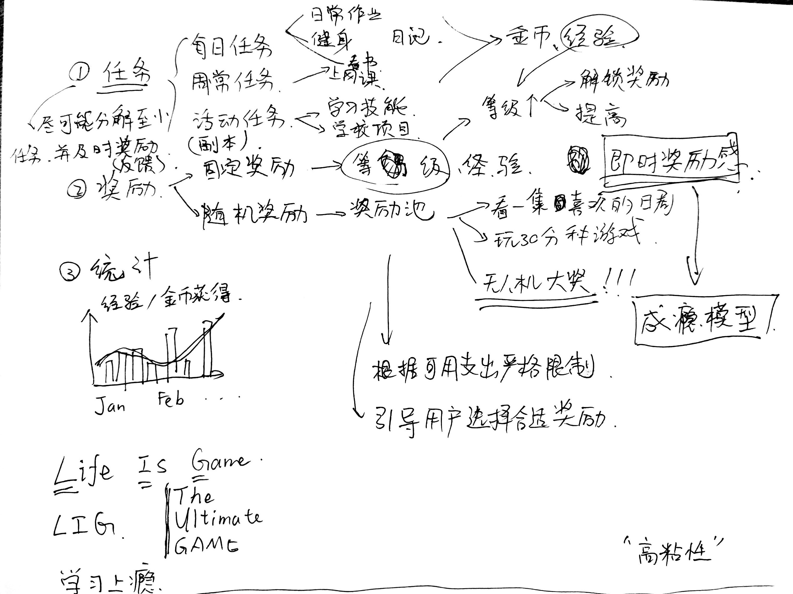
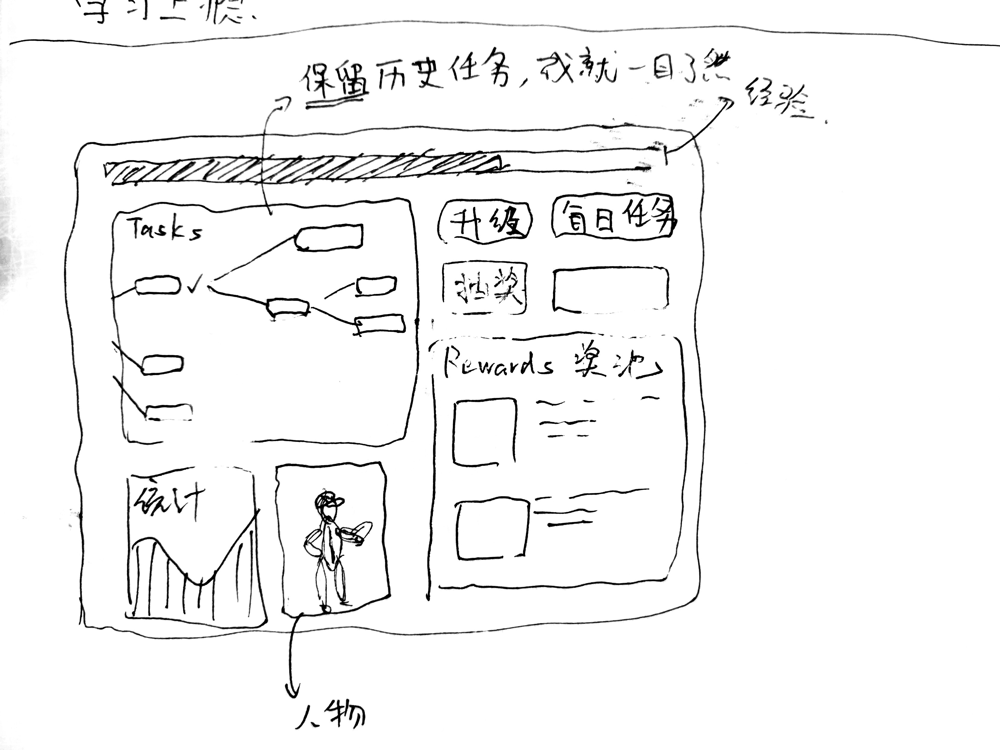

# The Ultimate Game

> 游戏为什么会如此让人上瘾？
> 
> 1. 游戏里会把目标分成小块，游戏会告诉你接下来怎么行动，非常明确。
> 2. 这些小目标完成后有相应的奖励，这个奖励当你完成目标时会立马发放给你，及时反馈。
> 
> 通过这两点，玩家无需考虑太多，只要按着任务流程一步步来就能达成自己的欲望。做任务升级原本是枯燥的，但任务完成后会立马获得经验和金币，奖励可能还会随着任务次数递增。但是在现实生活中呢？虽然有大目标，但做起来却无从下手，甚至有时候不知道大目标是什么。完成目标后也不会有及时的奖励。谁都知道学好英语要背单词，但是要背多少呢。背完了10个单词后我并没有发现我英语有什么提升，游戏里我做完任务经验槽立马涨了一点，背完10个单词我没啥感觉，反馈不及时不明显。
> 
> 作者：匿名用户
> 链接：https://www.zhihu.com/question/20262641/answer/59507300
> 来源：知乎
> 著作权归作者所有。商业转载请联系作者获得授权，非商业转载请注明出处。

如何把学习当游戏？ - 白衣君纸的回答 - 知乎
https://www.zhihu.com/question/20262641/answer/828702215

## 对标产品

- [玩成PlayTask](https://www.zhihu.com/question/47684675)

## Main Sections

## Wireframe

